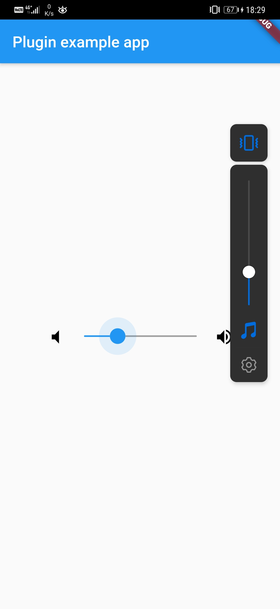
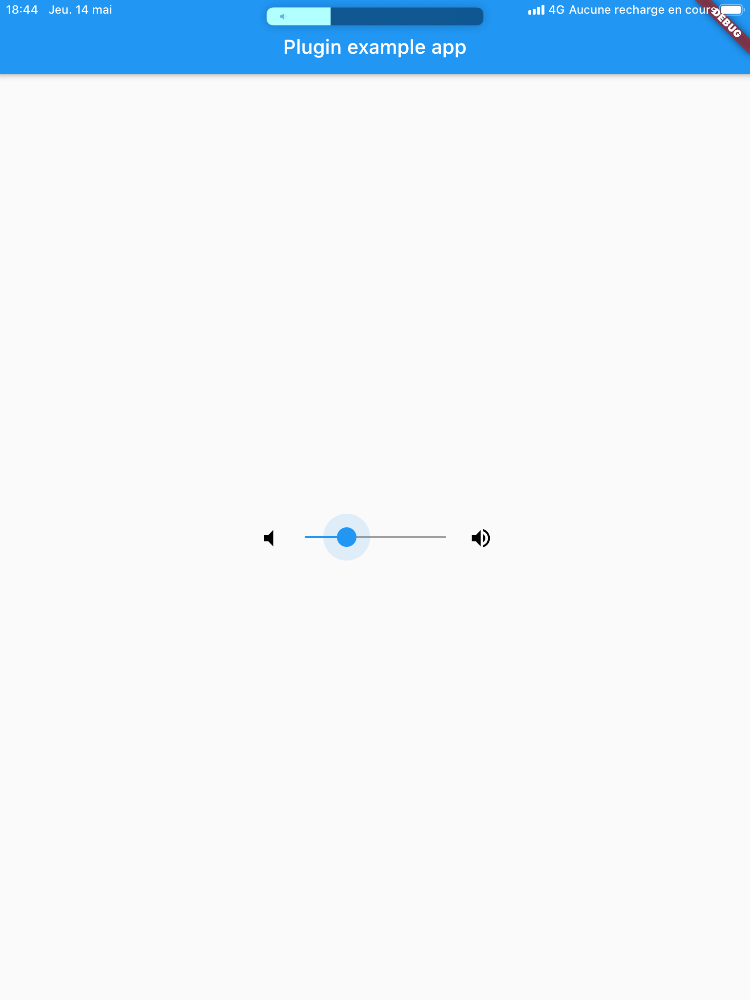

# FlutterVolumeSlider

[](https://pub.dev/packages/flutter_volume_slider)

A flutter widget to control volume in each Android & iOS native volume.



## How to use :

Just add VolumeSlider() Widget anywhere you want to control volume. Works Properly on Android and iOS.

```
...

  @override
  Widget build(BuildContext context) {
    return MaterialApp(
      home: Scaffold(
        appBar: AppBar(
          title: const Text('Plugin example app'),
        ),
        body: Center(
          child: FlutterVolumeSlider(
            sliderActiveColor: Colors.blue,
            sliderInActiveColor: Colors.grey,
          ),
        ),
      ),
    );
  }

```

